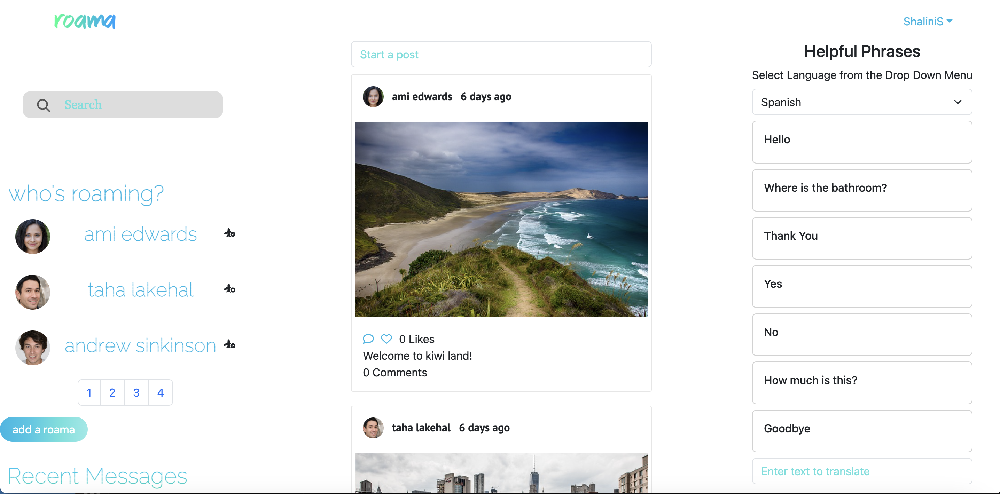

# Roama

## Description
    
Roama is a platform that brings together a vibrant community of like-minded travelers who share a passion for exploration. Make new friends, see who is roaming where, and make plans for your next travel destination based on posts and recommedations of other Roamas. Also check out the translation hub to see how common phrases and sentences of your choice are spoken in different languages across the world. 

Collaboration on this project was through git and the updated repository can be found at:

https://github.com/amilou86/Roama 

## Table of Contents

- [User Story](#user-story)
- [Features](#features)
- [Deployment](#deployment)
- [Screenshot](#screenshot)
- [Usage](#usage)
- [Technology stack](#technology-stack)
- [Installation](#installation)
- [Contributors](#contributors)
- [Questions](#questions)

## User Story

As a travel enthusiast, I want to post pictures and experiences about my travels, connect with other explorers, and find out more about different places and languages around the world within a safe online platform.

## Features

- Create an account, login, and manage your profile settings and pasword
- Add posts, browse, like and comment on posts about travels 
- Connect with friends, view frinds list and see who's online
- Send and receive messages from friends
- Search for posts
- View translations for common phrases and get text translated

## Deployment

Visit Roama deployed at: https://roama.netlify.app/


## Screenshot



## Usage

Please visit the deployed link above. Signup and login. Enjoy exploring Roama!

## Technology Stack

Roama is built on React and uses Bootstrap for CSS, and several npm packages including React-hook-form, React-hot-toast, React-icons, React-collapsed and React-timestamp. Data for translation is fetched from the Swift Translate API

## Installation

If you wish to run Roama locally, fork the git repository and clone it. Navigate to the cloned repository in your terminal and run the command, npm i, to install all the required packages. 

run json server to fetch data: // npx json-server --watch src/components/utils/random-posts.json --port 8000

To get the translation working  do the following:
- Go to https://rapidapi.com/myl117/api/swift-translate
- Sign up to obtain an API key
- Create a new file called keyConfig.js in the utils folder.
- Copy and paste the below code into the keyConfig.js file.

```
const API_KEY = 'YOUR-API-KEY-GOES-HERE';
export { API_KEY };
```

- Replace **YOUR-API-KEY-GOES-HERE** with your API key

## Contributors

- [Abdalla Diaai Mohamed](https://github.com/abdalla-diaai)
- [Ami Edwards](https://github.com/amilou86)
- [Andrew Sinkinson](https://github.com/Duouk2000)
- [Kwok Law](https://github.com/Digita1Panda)
- [Shalini Sunkuru](https://github.com/ShaliniSunkuru)
- [Taha Hadj Lakehal](https://github.com/Lecheeky)

## Questions

For any questions or feedback, please contact Team Roama. 


